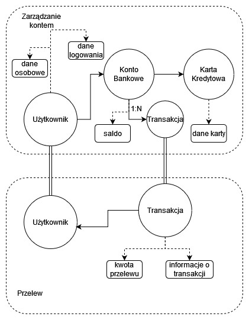

# Opis Zadania
Zadanie polegało na zamodelowaniu fragmentu bezpiecznej aplikacji bankowej wykorzystując zasady Domain Driven Design. W ramach zadania należało zidentyfikować i zdefiniować konteksty w obrębie systemu bankowego, stworzyć Agregaty oraz Encje. Dodatkowo należało wyróżnić Obiekty Wartości i zdefiniować przyjęte założenia.
# Model
Na poniższym diagramie przedstawiony został zamodelowany fragment aplikacji bankowej:

Zdefiniowano dwa konteksty: Zarządzanie kontem oraz Przelew. Encje zostały oznaczone okręgami, natomiast obiekty wartości zostały oznaczone owalnymi prostokątami.

# Przyjęte Założenia
Dla modelu przyjęto następujące założenia:
- encja Użytkownik składa się z danych osobowych - imienia, nazwiska, adresu zamieszkania oraz danych logowania - maila, hasła, ustawionej metody 2FA.
- każdy Użytkownik posiada co najmniej jedno Konto Bankowe. Atrybuty Konta Bankowego to saldo, historia Transakcji (zaznaczona relacją 1:N) oraz ustawiona konfiguracja konta (limity transakcji).
- do Konta Bankowego przypisana jest co najmniej jedna Karta Kredytowa. Dane karty to jej numer, data ważności i kod weryfikacyjny karty.
- Transakcja składa się z daty przelewu, nadawcy, odbiorcy, tytułu oraz kwoty przelewu.
- W kontekście Przelewu, Transakcja jest czynnością wykonywaną przez Użytkownika. W kontekście Zarządzania kontem, lista Transakcji jest historią operacji.
- Użytkownik nie może wykonać przelewu w kontekście Zarządzania kontem, ani nie może zmienić ustawień Konta Bankowego w kontekście Przelewu.